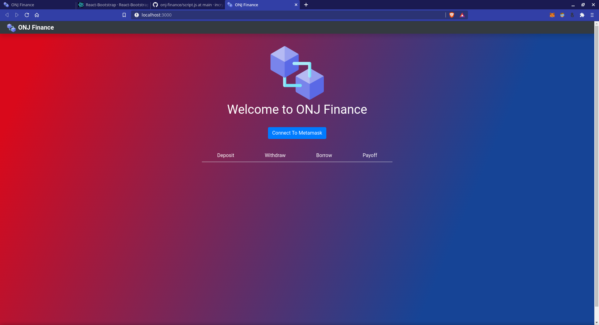
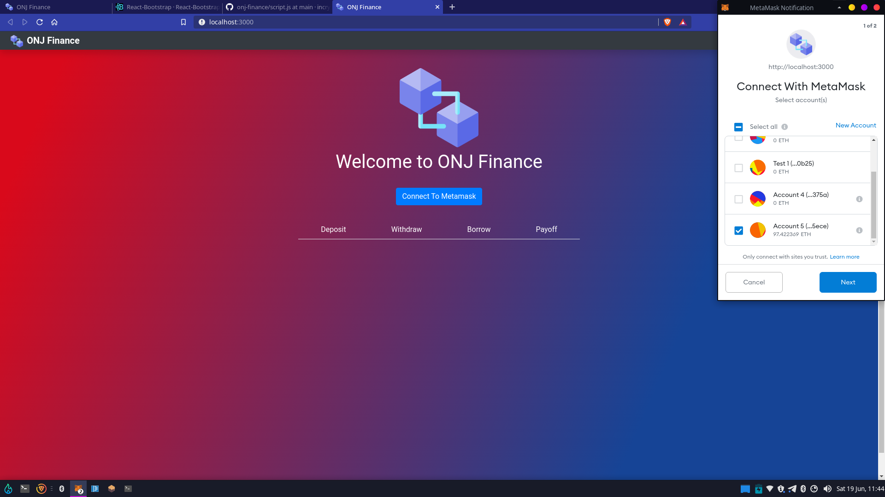
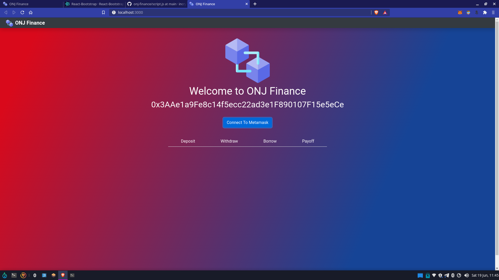
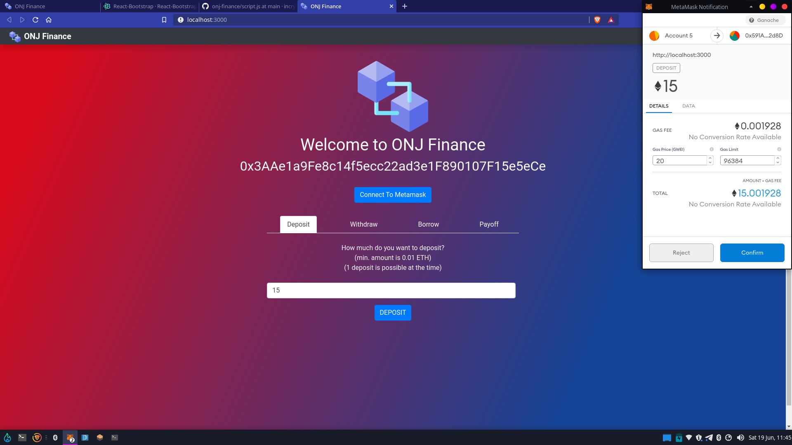
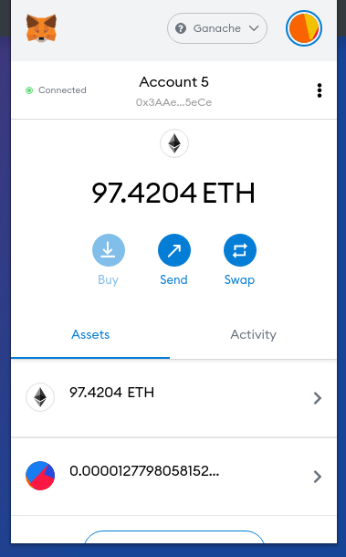

# ONJ FINANCE

A decentralized finance application in which you can stake your coins and earn interest in the custom made ERC20 token (ONJI Token) of the platform .
Users can also get loans from this Dapp.

Use the app deployed in ropsten test network [https://onj-finance.web.app/](https://onj-finance.web.app/)
You might need some ropsten test ether to try it out. Check out [https://faucet.ropsten.be/](https://faucet.ropsten.be/) to obtain some test ether on ropsten network.
You will also need the metamask browser wallet extension.
# Some Screenshots

